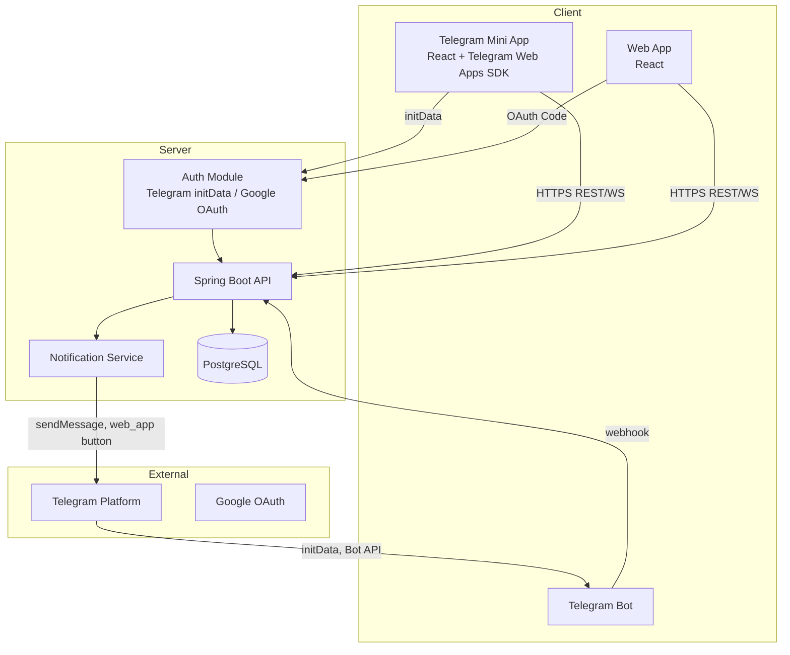
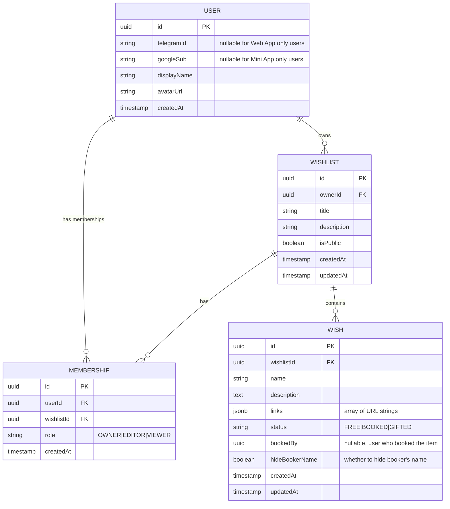
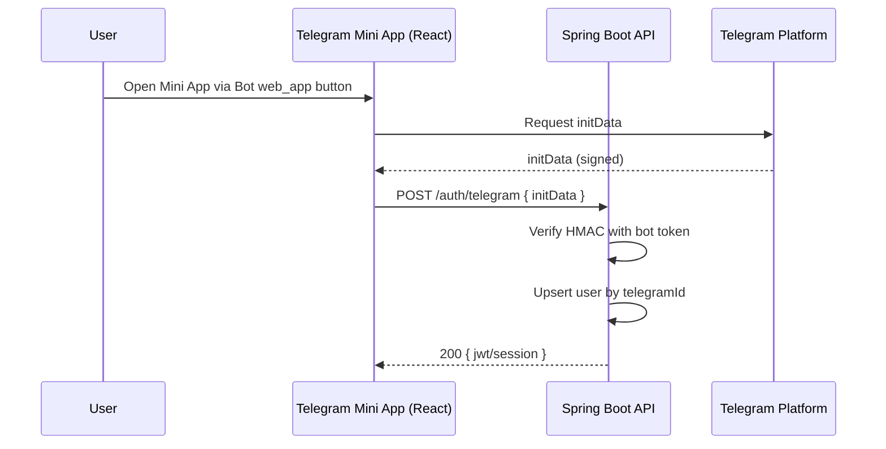
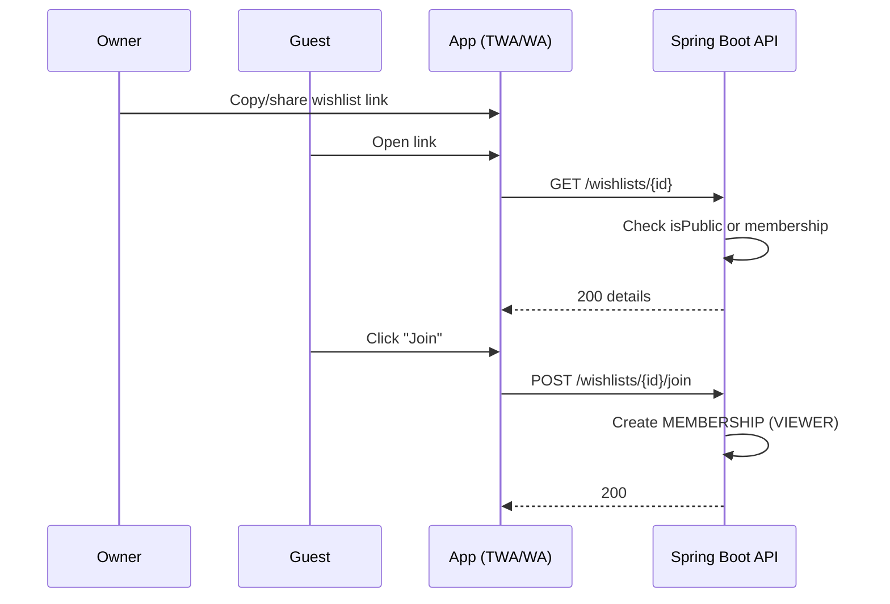
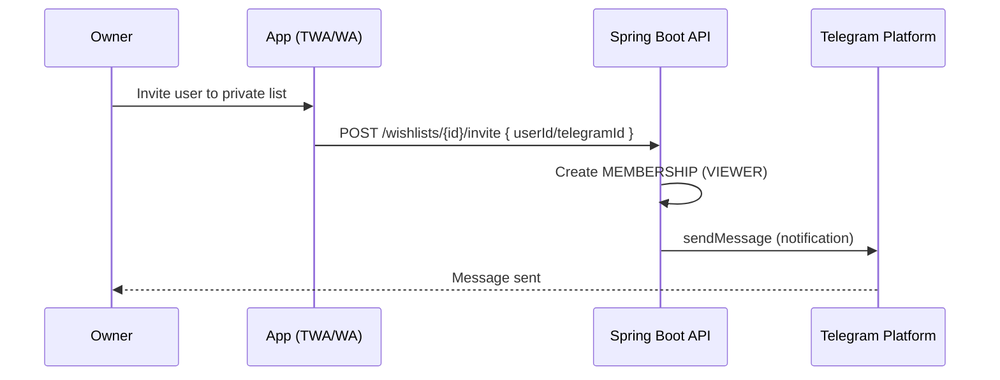
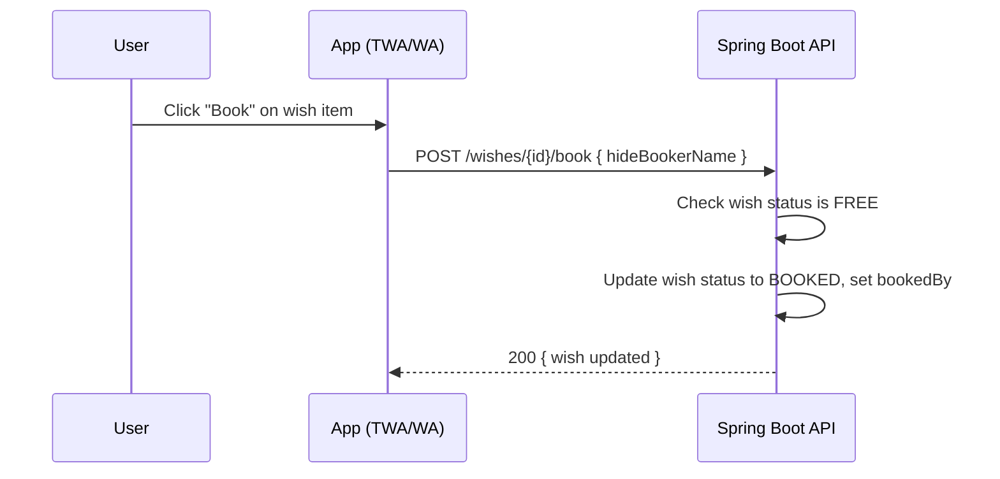
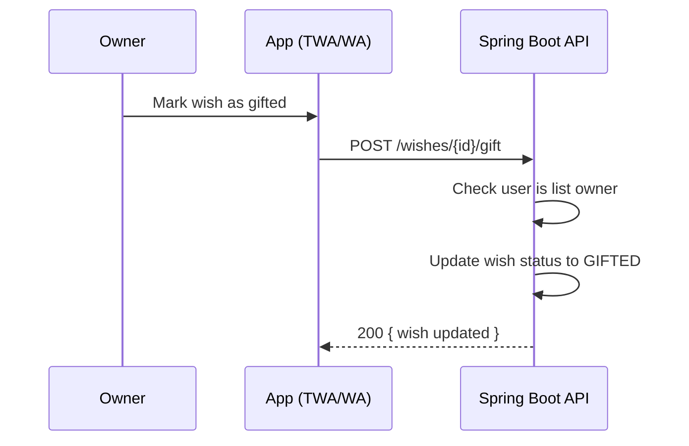

## Wish Manager — System Design

### Scope and Requirements

- **Mini App (Telegram)**: Users create multiple wishlists; invite others; public or private lists; wishes have required name and optional URL(s); login via Telegram only.
- **Web App**: Same features as Mini App; login via Telegram or Google OAuth.
- **Auth**: Telegram Mini App via `initData` verification; Web App via Telegram `initData` verification or Google OAuth 2.0; backend sessions/JWT.
- **Bot**: Provides "Open wishlist" button (`web_app`) and sends notifications to users/chats.
- **Backend**: Spring Boot (Java 17+), PostgreSQL, Dockerized.
- **Hosting**: Docker-based deployment.

### High-Level Architecture



### Core Domain Model (ER)



### Authentication and Authorization

- **Telegram Mini App**:
  - Frontend receives `initData` from Telegram Web Apps SDK.
  - Backend verifies HMAC SHA-256 signature with the bot token.
  - On success, creates/fetches user by `telegramId`, issues session/JWT.
- **Web App (Telegram Auth)**:
  - Same as Mini App: receives `initData` from Telegram Web Apps SDK.
  - Backend verifies HMAC SHA-256 signature with the bot token.
  - On success, creates/fetches user by `telegramId`, issues session/JWT.
- **Web App (Google OAuth 2.0)**:
  - SPA uses PKCE + OAuth code flow.
  - Backend exchanges code for tokens, verifies `id_token` (`sub`, `aud`, `exp`).
  - Creates/fetches user by `googleSub`, issues session/JWT.
- **Authorization**:
  - Access to a `WISHLIST` if:
    - Owner, or
    - `isPublic = true`, or
    - Membership exists with `VIEWER`/`EDITOR`/`OWNER`.
  - Editors can add/update wishes; viewers read-only.
  - Any authenticated user can book FREE wishes; only booker or list owner can unbook.
  - Only list owner can mark wishes as GIFTED or UNGIFTED.
  - Booked wishes show booker name unless `hideBookerName = true`.

### Key Flows (Sequences)

#### Telegram Mini App Login



#### Web App Login (Google OAuth)

```mermaid
sequenceDiagram
  participant User
  participant WA as Web App (React)
  participant API as Spring Boot API
  participant Google as Google OAuth

  User->>WA: Click Sign in with Google
  WA->>Google: OAuth Auth Request (PKCE)
  Google-->>WA: Auth Code (redirect)
  WA->>API: POST /auth/google { code, verifier }
  API->>Google: Token Exchange
  Google-->>API: id_token, access_token
  API->>API: Verify id_token; upsert user by sub
  API-->>WA: 200 { jwt/session }
```

#### Share and Join Public Wishlist



#### Private Invite



#### Book Wish Item



#### Mark Wish as Gifted



### Backend Modules (Spring Boot)

- **Controllers**: `AuthController`, `WishlistController`, `WishController`, `MembershipController`, `BotWebhookController`.
- **Services**: `TelegramAuthService`, `GoogleAuthService`, `WishlistService`, `WishService`, `MembershipService`, `NotificationService`.
- **Persistence**: JPA/Hibernate entities for `User`, `Wishlist`, `Wish`, `Membership`; repositories; Flyway migrations.
- **Security**: Stateless JWT with filter; session alternative for server-side if desired.

### API Sketch

- `POST /auth/telegram` — verify `initData` (for Mini App and Web App), return JWT/session.
- `POST /auth/google` — exchange code+verifier (for Web App only), return JWT/session.
- `GET /me` — profile; lists the user's memberships and owned lists summary.
- `POST /wishlists` — create wishlist (title, description, isPublic).
- `GET /wishlists?owner={id}&public=true` — discover public lists of a user.
- `GET /wishlists/{id}` — get list details + wishes if authorized.
- `POST /wishlists/{id}/join` — self-join public list.
- `POST /wishlists/{id}/invite` — add member to private list.
- `POST /wishlists/{id}/leave` — leave membership.
- `POST /wishlists/{id}/wishes` — add wish (name required, links optional).
- `PATCH /wishes/{id}` — update wish.
- `DELETE /wishes/{id}` — remove wish.
- `POST /wishes/{id}/book` — book a wish item (hideBookerName optional).
- `POST /wishes/{id}/unbook` — unbook a wish item (only by booker or list owner).
- `POST /wishes/{id}/gift` — mark wish as gifted (only by list owner).
- `POST /wishes/{id}/ungift` — unmark wish as gifted (only by list owner).

### Deployment & Hosting (Docker)

```mermaid
graph LR
  subgraph Docker Host
    NGINX[Reverse Proxy / TLS]
    REACT[Web App (static)]
    API[Spring Boot]
    DB[(PostgreSQL)]
    BOT[Bot Webhook Endpoint (part of API)]
  end

  UserBrowser-->NGINX
  NGINX-->REACT
  NGINX-->API
  API-->DB
  TelegramCloud-->NGINX
  NGINX-->API
```

Notes:
- Serve the Mini App frontend as a separate build or via the same React codebase behind different routes.
- Bot webhook handled by the same Spring Boot app (endpoint secured with a secret path/token).
- Use Flyway for DB migrations. Prefer JSONB for `links` to allow multiple URLs.
- Consider WebSocket/SSE for realtime notifications within the app in addition to Telegram chat messages.

### Security Considerations

- Verify Telegram `initData` within 1 minute of issuance; reject stale or invalid signatures.
- Store minimal PII; avoid storing Google access tokens unless required; prefer `sub` and profile basics.
- Enforce authorization checks on every wishlist/wish mutation.
- Rate-limit invites and bot-triggered actions; validate URLs for wishes.

### Non-Functional Requirements

- **Scalability**: Stateless API, horizontal scale; DB with proper indices (`ownerId`, `isPublic`, `wishlistId`).
- **Reliability**: Transactions for membership/wish changes; idempotent invite endpoints.
- **Observability**: Structured logs, metrics for auth failures, cache hits, notifications sent.
- **Performance**: Pagination for list discovery and wish retrieval; cache public lists when appropriate.


